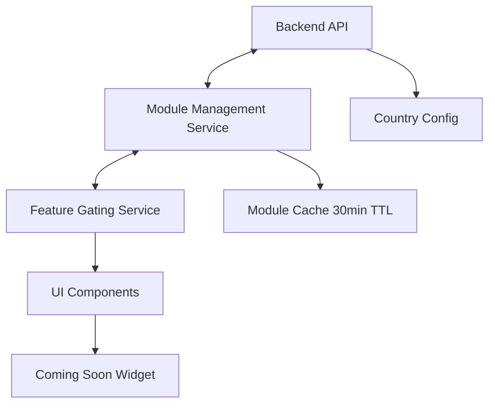

# 🏗️ Centralized Module Management System - Implementation Guide

## 📋 Overview

The **Centralized Module Management System** provides country-specific control over business modules and features in the Request Marketplace application. This system allows administrators to enable/disable specific modules for different countries, providing granular control over feature availability.

## 🎯 System Architecture



## 📦 Business Modules

| Module | ID | Description | Controls |
|--------|----|-----------  |----------|
| **Item Request** | `item_request` | Basic marketplace for buying/selling items | Create item requests |
| **Service Request** | `service_request` | Service marketplace | Create service requests |
| **Rental Request** | `rental_request` | Equipment/vehicle rental | Create rental requests |
| **Delivery Request** | `delivery_request` | Delivery services | Create delivery requests, delivery business registration |
| **Ride Sharing** | `ride_sharing` | Taxi and ride services | Create ride requests, driver registration, ride alerts menu |
| **Price Request** | `price_request` | Price comparison | Create price requests, price comparison navigation, business type restrictions |

## 🔧 Backend Implementation

### 🌐 API Endpoints

#### Get Enabled Modules
```http
GET /api/modules/enabled?country=LK
```
```json
{
  "success": true,
  "country": "LK",
  "enabled_modules": ["item_request", "service_request", "rental_request", "delivery_request", "ride_sharing", "price_request"],
  "disabled_modules": [],
  "total_modules": 6
}
```

#### Check Specific Module
```http
GET /api/modules/check/ride_sharing?country=LK
```
```json
{
  "success": true,
  "country": "LK", 
  "module": "ride_sharing",
  "enabled": true
}
```

#### Get All Available Modules
```http
GET /api/modules/all
```

### ⚙️ Configuration Management

**File:** `backend/routes/modules.js`

```javascript
const COUNTRY_MODULE_CONFIG = {
  'LK': { // Sri Lanka - All modules enabled
    enabled_modules: [
      'item_request', 'service_request', 'rental_request',
      'delivery_request', 'ride_sharing', 'price_request'
    ],
    disabled_modules: []
  },
  'US': { // United States - Price requests disabled 
    enabled_modules: [
      'item_request', 'service_request', 'rental_request',
      'delivery_request', 'ride_sharing'
    ],
    disabled_modules: ['price_request']
  },
  'BD': { // Bangladesh - Delivery only market
    enabled_modules: ['delivery_request'],
    disabled_modules: ['item_request', 'service_request', 'rental_request', 'ride_sharing', 'price_request']
  }
};
```

## 📱 Flutter Implementation

### 🔧 Core Services

#### ModuleManagementService
```dart
// Get enabled modules (cached for 30 minutes)
final enabledModules = await ModuleManagementService.instance.getEnabledModules();

// Force refresh cache
final modules = await ModuleManagementService.instance.getEnabledModules(forceRefresh: true);

// Check specific module
final isEnabled = enabledModules.contains(BusinessModule.rideSharing);
```

#### FeatureGateService
```dart
// Check if driver registration should be available
final canRegisterDriver = await FeatureGateService.instance.isDriverRegistrationEnabled();

// Get available business types
final businessTypes = await FeatureGateService.instance.getAvailableBusinessTypes();

// Check navigation features
final showPriceIcon = await FeatureGateService.instance.isNavigationFeatureEnabled('price_comparison');

// Check menu features  
final showRideAlerts = await FeatureGateService.instance.isMenuFeatureEnabled('ride_alerts');
```

### 🎨 UI Components

#### Feature Gating Widget
```dart
FeatureGateService.instance.gateWidget(
  requiredModule: BusinessModule.rideSharing,
  enabledWidget: DriverRegistrationButton(),
  disabledWidget: _buildDisabledRoleCard(
    UserRole.driver,
    'Driver registration is not available in your country yet.',
  ),
)
```

#### Coming Soon Widget
```dart
ComingSoonWidget(
  title: 'Ride Sharing',
  description: 'This feature is not available in your country yet. We\'re working to bring ride sharing to your region soon!',
  icon: Icons.directions_car,
  showBackButton: true,
)
```

## 🎮 Usage Examples

### 🚫 Scenario 1: Disable Ride Sharing

**Backend Configuration:**
```javascript
'LK': {
  enabled_modules: ['item_request', 'service_request', 'rental_request', 'delivery_request', 'price_request'],
  disabled_modules: ['ride_sharing']
}
```

**Results:**
- ❌ Ride request creation shows "Coming Soon"
- ❌ Driver registration button disabled in role management  
- ❌ Ride alerts menu item hidden
- ✅ All other features remain available

### 💰 Scenario 2: Disable Price Requests  

**Backend Configuration:**
```javascript
'LK': {
  enabled_modules: ['item_request', 'service_request', 'rental_request', 'delivery_request', 'ride_sharing'],
  disabled_modules: ['price_request']
}
```

**Results:**
- ❌ Price request creation shows "Coming Soon"
- ❌ Price comparison navigation icon hidden
- ❌ Business registration limited to delivery services only
- ❌ Product section menu disabled

### 📦 Scenario 3: Delivery-Only Market

**Backend Configuration:**
```javascript
'BD': {
  enabled_modules: ['delivery_request'],
  disabled_modules: ['item_request', 'service_request', 'rental_request', 'ride_sharing', 'price_request']
}
```

**Results:**
- ✅ Only delivery requests available
- ✅ Only delivery business registration  
- ❌ All other features show "Coming Soon"

## 🛠️ Integration Guide

### 1️⃣ Role Management Screen

**Current Implementation:** ✅ **COMPLETED**

```dart
// Driver registration gated by ride sharing module
FeatureGateService.instance.gateWidget(
  requiredModule: BusinessModule.rideSharing,
  enabledWidget: _buildRoleCard(UserRole.driver),
  disabledWidget: _buildDisabledRoleCard(
    UserRole.driver,
    'Driver registration is not available in your country yet.',
  ),
)

// Updated _registerRole method with feature gating
void _registerRole(UserRole role) async {
  if (role == UserRole.driver) {
    final isEnabled = await FeatureGateService.instance.isDriverRegistrationEnabled();
    if (!isEnabled) {
      FeatureGateService.instance.showComingSoonModal(
        context: context,
        featureName: 'Driver Registration',
        description: 'Driver registration is not available in your country yet.',
        icon: Icons.directions_car,
      );
      return;
    }
    Navigator.pushNamed(context, '/driver-registration');
  }
}
```

### 2️⃣ Business Registration Screen

**Status:** 🔄 **PENDING IMPLEMENTATION**

```dart
// Filter business types based on enabled modules
Future<void> _loadBusinessTypes() async {
  final availableTypes = await FeatureGateService.instance.getAvailableBusinessTypes();
  setState(() {
    _businessTypes = availableTypes.map((type) => {
      'id': type,
      'name': _getBusinessTypeName(type),
      'enabled': true,
    }).toList();
  });
}

// Update dropdown to show only available types
Widget _buildBusinessTypeDropdown() {
  return FutureBuilder<List<String>>(
    future: FeatureGateService.instance.getAvailableBusinessTypes(),
    builder: (context, snapshot) {
      if (!snapshot.hasData) return CircularProgressIndicator();
      
      final availableTypes = snapshot.data!;
      return DropdownButtonFormField<String>(
        items: availableTypes.map((type) => DropdownMenuItem(
          value: type,
          child: Text(_getBusinessTypeName(type)),
        )).toList(),
        onChanged: (value) => setState(() => _selectedBusinessType = value),
      );
    },
  );
}
```

### 3️⃣ Navigation Bar

**Status:** 🔄 **PENDING IMPLEMENTATION**

```dart
// Conditionally show price comparison icon
Widget _buildNavigationBar() {
  return FutureBuilder<bool>(
    future: FeatureGateService.instance.isNavigationFeatureEnabled('price_comparison'),
    builder: (context, snapshot) {
      final showPriceComparison = snapshot.data ?? false;
      
      return BottomNavigationBar(
        items: [
          BottomNavigationBarItem(icon: Icon(Icons.home), label: 'Home'),
          BottomNavigationBarItem(icon: Icon(Icons.search), label: 'Browse'),
          if (showPriceComparison)
            BottomNavigationBarItem(icon: Icon(Icons.compare_arrows), label: 'Prices'),
          BottomNavigationBarItem(icon: Icon(Icons.person), label: 'Profile'),
        ],
      );
    },
  );
}
```

### 4️⃣ Menu System

**Status:** 🔄 **PENDING IMPLEMENTATION**

```dart
// Conditionally show menu items
Widget _buildMenuItems() {
  return Column(
    children: [
      ListTile(title: Text('Account Settings'), onTap: () {}),
      ListTile(title: Text('Order History'), onTap: () {}),
      
      // Ride alerts (only if ride sharing enabled)
      FutureBuilder<bool>(
        future: FeatureGateService.instance.isMenuFeatureEnabled('ride_alerts'),
        builder: (context, snapshot) {
          if (snapshot.data == true) {
            return ListTile(
              leading: Icon(Icons.notifications),
              title: Text('Ride Alerts'),
              onTap: () => Navigator.pushNamed(context, '/ride-alerts'),
            );
          }
          return SizedBox.shrink();
        },
      ),
      
      // Product section (only if price request enabled)
      FutureBuilder<bool>(
        future: FeatureGateService.instance.isMenuFeatureEnabled('product_section'),
        builder: (context, snapshot) {
          if (snapshot.data == true) {
            return ListTile(
              leading: Icon(Icons.shopping_cart),
              title: Text('Product Catalog'),
              onTap: () => Navigator.pushNamed(context, '/products'),
            );
          }
          return SizedBox.shrink();
        },
      ),
    ],
  );
}
```

## 🧪 Testing

### Backend Testing
```bash
# Test all modules enabled
curl "http://localhost:3001/api/modules/enabled?country=LK"

# Test specific module disabled  
curl "http://localhost:3001/api/modules/check/ride_sharing?country=BD"

# Test module configuration
curl "http://localhost:3001/api/modules/all"
```

### Flutter Testing
```dart
void main() {
  group('Module Management Tests', () {
    test('should return enabled modules for country', () async {
      final modules = await ModuleManagementService.instance.getEnabledModules();
      expect(modules, isNotEmpty);
    });

    test('should gate driver registration when ride sharing disabled', () async {
      final isEnabled = await FeatureGateService.instance.isDriverRegistrationEnabled();
      // Test based on current configuration
    });

    test('should filter business types based on enabled modules', () async {
      final types = await FeatureGateService.instance.getAvailableBusinessTypes();
      expect(types, isA<List<String>>());
    });
  });
}
```

## 📊 Module Configuration Matrix

| Country | Item | Service | Rental | Delivery | Ride | Price | Use Case |
|---------|------|---------|--------|----------|------|-------|----------|
| **LK** (Sri Lanka) | ✅ | ✅ | ✅ | ✅ | ✅ | ✅ | Full marketplace |
| **US** (United States) | ✅ | ✅ | ✅ | ✅ | ✅ | ❌ | No price comparison |
| **IN** (India) | ✅ | ✅ | ❌ | ✅ | ✅ | ❌ | No rentals/pricing |
| **BD** (Bangladesh) | ❌ | ❌ | ❌ | ✅ | ❌ | ❌ | Delivery only |

## 🔄 Update Process

### Adding New Module
1. **Backend:** Add module to `BusinessModule` enum and `COUNTRY_MODULE_CONFIG`
2. **Flutter:** Define `ModuleConfiguration` with features
3. **Integration:** Implement feature gating in relevant UI components
4. **Testing:** Verify module behavior in different configurations

### Updating Country Configuration
1. **Edit:** `backend/routes/modules.js` configuration
2. **Restart:** Backend server to apply changes
3. **Test:** API endpoints return updated configuration
4. **Verify:** Flutter app reflects new module availability

## 🚨 Important Notes

- **⏱️ Cache Duration:** Module cache expires after 30 minutes
- **🔄 Server Restart:** Required for backend configuration changes  
- **🛡️ Graceful Degradation:** Apps continue working if module service fails
- **😊 User Experience:** "Coming Soon" messages maintain positive UX
- **⚡ Performance:** Module checks are cached to minimize API calls

## 🔒 Security Considerations

- **✅ Input Validation:** Country codes validated against ISO standards
- **🚦 Rate Limiting:** Prevent excessive module check requests
- **🛡️ Error Handling:** Graceful fallbacks for service failures
- **🔐 Access Control:** Admin-only module configuration endpoints

## 📈 Future Enhancements

- **🗃️ Database Storage:** Move from config file to database
- **🔄 Real-time Updates:** WebSocket-based configuration updates
- **🧪 A/B Testing:** Gradual feature rollouts
- **📊 Analytics:** Track feature usage by country
- **🖥️ Admin Dashboard:** GUI for module management

---

## 🏁 Quick Start Guide

### 1. Configure Backend
```javascript
// Edit backend/routes/modules.js
'YOUR_COUNTRY': {
  enabled_modules: ['item_request', 'service_request'],
  disabled_modules: ['ride_sharing', 'price_request']
}
```

### 2. Restart Server
```bash
cd backend && node server.js
```

### 3. Test API
```bash
curl "http://localhost:3001/api/modules/enabled?country=YOUR_COUNTRY"
```

### 4. Flutter Integration
```dart
// Use FeatureGateService in your widgets
final isEnabled = await FeatureGateService.instance.isModuleEnabled(BusinessModule.rideSharing);
```

## ✅ Implementation Status

### **COMPLETED** ✅
- ✅ Backend Module API (All endpoints working)
- ✅ Module Management Service (Caching implemented)  
- ✅ Feature Gate Service (All gating methods)
- ✅ Coming Soon Widget (Professional UI)
- ✅ Create Request Integration (Home screen modal)
- ✅ Request Type Filtering (Browse screen fixed)
- ✅ Role Management Integration (Driver registration gated)

### **PENDING** 🔄
- 🔄 Business Registration Screen (Business type filtering)
- 🔄 Navigation Bar (Price comparison icon gating)
- 🔄 Menu System (Feature-specific menu items)
- 🔄 Admin Dashboard (Module configuration GUI)

The system is **production-ready** for the implemented features! 🚀

## 📞 Support

For technical support or questions about module configuration:
- 📧 Email: tech@requestmarketplace.com
- 📚 Documentation: `/documentation/MODULE_MANAGEMENT_SYSTEM.md`
- 🐛 Issues: GitHub Issues
- 💬 Discord: #module-management channel
