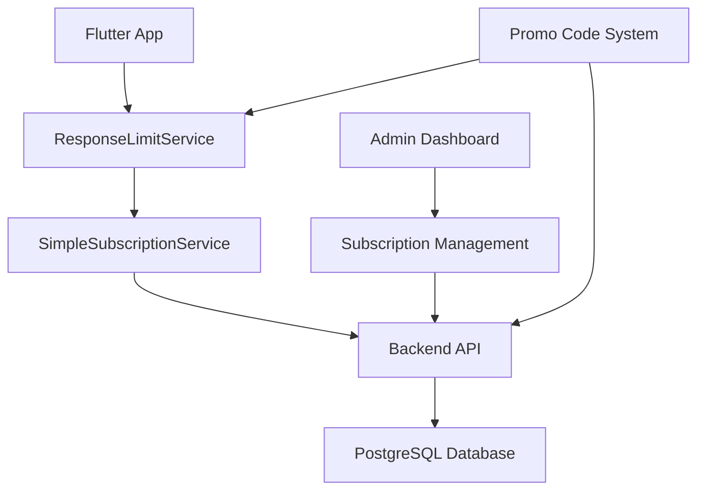
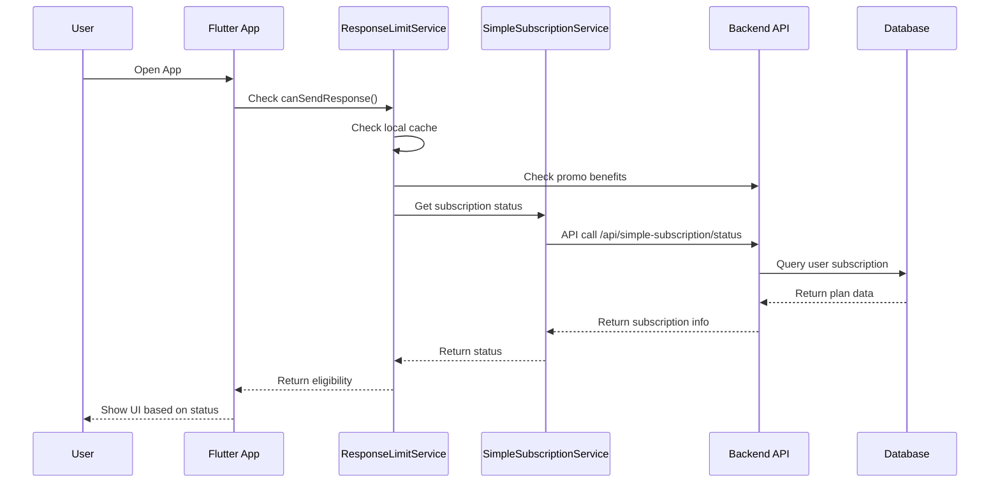

# Subscription System & Promo Code Documentation

## Table of Contents
1. [System Overview](#system-overview)
2. [Subscription System](#subscription-system)
3. [Promo Code System](#promo-code-system)
4. [API Endpoints](#api-endpoints)
5. [Database Schema](#database-schema)
6. [Frontend Components](#frontend-components)
7. [Integration Guide](#integration-guide)
8. [Testing & Usage](#testing--usage)

---

## System Overview

The subscription system provides tiered access control with:
- **Free Plan**: 3 responses per month
- **Pro Plan**: Unlimited responses
- **Promo Benefits**: Temporary unlimited access via promotional codes

### Key Features
- Real-time subscription status synchronization
- Promotional code redemption system
- Admin management interface
- Automatic benefit activation
- Usage tracking and analytics

---

## Subscription System

### Architecture



### Core Components

#### 1. ResponseLimitService (`lib/services/subscription/response_limit_service.dart`)

**Purpose**: Manages response limits and subscription status caching

**Key Methods**:
```dart
// Check if user can send a response
static Future<bool> canSendResponse()

// Get remaining responses for the month
static Future<int> getRemainingResponses()

// Check if user has unlimited plan (including promo benefits)
static Future<bool> hasUnlimitedPlan()

// Sync subscription status with backend
static Future<void> syncWithBackend()

// Check for active promo benefits
static Future<bool> _hasActivePromoBenefits()
```

**Logic Flow**:
1. Check local cache for unlimited plan status
2. Check for active promo benefits via API
3. If neither, fetch usage count from backend
4. Return eligibility based on free plan limits (3/month)

#### 2. SimpleSubscriptionService (`lib/src/services/simple_subscription_service.dart`)

**Purpose**: Backend communication for subscription data

**Key Methods**:
```dart
// Get user's subscription status
Future<SimpleSubscriptionStatus?> getSubscriptionStatus()

// Check if user can respond to requests
Future<ResponseEligibility> canRespond()
```

### Subscription Status Flow



---

## Promo Code System

### Overview

The promo code system allows users to redeem promotional codes for temporary subscription benefits, primarily free unlimited access for a specified duration.

### Database Schema

#### Promo Codes Table
```sql
CREATE TABLE promo_codes (
    id SERIAL PRIMARY KEY,
    code VARCHAR(50) UNIQUE NOT NULL,
    name VARCHAR(255) NOT NULL,
    description TEXT,
    benefit_type VARCHAR(20) NOT NULL DEFAULT 'free_plan',
    benefit_duration_days INTEGER NOT NULL DEFAULT 30,
    benefit_plan_code VARCHAR(20) DEFAULT 'Pro',
    discount_percentage DECIMAL(5,2),
    max_uses INTEGER,
    max_uses_per_user INTEGER DEFAULT 1,
    current_uses INTEGER DEFAULT 0,
    valid_from TIMESTAMP DEFAULT CURRENT_TIMESTAMP,
    valid_until TIMESTAMP,
    is_active BOOLEAN DEFAULT true,
    created_by INTEGER,
    created_at TIMESTAMP DEFAULT CURRENT_TIMESTAMP,
    updated_at TIMESTAMP DEFAULT CURRENT_TIMESTAMP
);
```

#### Promo Code Redemptions Table
```sql
CREATE TABLE promo_code_redemptions (
    id SERIAL PRIMARY KEY,
    promo_code_id INTEGER REFERENCES promo_codes(id),
    user_id INTEGER NOT NULL,
    redeemed_at TIMESTAMP DEFAULT CURRENT_TIMESTAMP,
    benefit_start_date TIMESTAMP DEFAULT CURRENT_TIMESTAMP,
    benefit_end_date TIMESTAMP NOT NULL,
    granted_plan_code VARCHAR(20),
    status VARCHAR(20) DEFAULT 'active',
    ip_address INET,
    user_agent TEXT
);
```

### Benefit Types

1. **free_plan**: Grant free access to a specific plan for duration
2. **discount**: Percentage discount on subscription purchase
3. **extension**: Extend current subscription by duration

### Core Functions

#### Database Functions

**can_user_use_promo_code(promo_id, user_id)**
- Validates if user can use a specific promo code
- Checks expiry, usage limits, and user eligibility

**redeem_promo_code(code, user_id, ip, user_agent)**
- Atomically redeems a promo code
- Creates redemption record
- Updates usage counters
- Returns redemption details

### API Endpoints

#### User Endpoints

**POST /api/promo-codes/validate**
```json
{
  "code": "WELCOME30"
}
```
Response:
```json
{
  "success": true,
  "valid": true,
  "user_can_use": true,
  "message": "Get 30 days of Pro access for free!",
  "promo": {
    "name": "Welcome Free Month",
    "description": "Welcome new users with free Pro access",
    "benefit_type": "free_plan",
    "benefit_duration_days": 30,
    "benefit_plan_code": "Pro"
  }
}
```

**POST /api/promo-codes/redeem**
```json
{
  "code": "WELCOME30"
}
```
Response:
```json
{
  "success": true,
  "redemption_id": "123",
  "benefit_plan": "Pro",
  "benefit_end_date": "2025-10-13T00:00:00Z",
  "message": "Successfully redeemed! Enjoy 30 days of Pro access."
}
```

**GET /api/promo-codes/check-active**
Response:
```json
{
  "success": true,
  "has_active_promo": true,
  "active_promo": {
    "id": "123",
    "code": "WELCOME30",
    "name": "Welcome Free Month",
    "granted_plan_code": "Pro",
    "benefit_end_date": "2025-10-13T00:00:00Z",
    "days_remaining": 30
  }
}
```

#### Admin Endpoints

**GET /api/promo-codes/admin/list**
- Returns all promo codes with usage statistics
- Admin authentication required

**POST /api/promo-codes/admin/create**
- Create new promo code
- Full validation and duplicate checking

**PUT /api/promo-codes/admin/:id**
- Update existing promo code
- Preserves usage statistics

**DELETE /api/promo-codes/admin/:id**
- Delete promo code (only if unused)
- Safety checks prevent deletion of used codes

---

## Frontend Components

### Flutter Components

#### 1. PromoCodeScreen (`lib/src/screens/promo_code_screen.dart`)

**Features**:
- Real-time code validation as user types
- Animated feedback (success/error states)
- Benefit preview before redemption
- Auto-sync subscription status after redemption

**Key UI Elements**:
```dart
// Code input with auto-formatting
TextField(
  controller: _promoCodeController,
  onChanged: _onPromoCodeChanged,
  textCapitalization: TextCapitalization.characters,
  inputFormatters: [UpperCaseTextFormatter()],
)

// Real-time validation indicator
Widget _buildValidationIndicator() {
  if (_isValidating) return CircularProgressIndicator();
  return Icon(_isCodeValid ? Icons.check_circle : Icons.error);
}

// Benefit details display
Widget _buildPromoDetails() {
  return AnimatedContainer(
    decoration: BoxDecoration(
      color: Colors.green.withOpacity(0.1),
      borderRadius: BorderRadius.circular(12),
    ),
    child: // Benefit information display
  );
}
```

#### 2. Subscription Integration

The promo code system seamlessly integrates with existing subscription checks:

```dart
// Enhanced canSendResponse logic
static Future<bool> canSendResponse() async {
  // 1. Check permanent subscription
  final hasUnlimited = prefs.getBool(_hasUnlimitedPlanKey) ?? false;
  if (hasUnlimited) return true;
  
  // 2. Check active promo benefits
  final hasActivePromo = await _hasActivePromoBenefits();
  if (hasActivePromo) return true;
  
  // 3. Check free plan limits
  final responseCount = await _getBackendResponseCount();
  return responseCount < _freeMonthlyLimit;
}
```

### React Admin Components

#### 1. SubscriptionPromoCodes (`admin-react/src/pages/SubscriptionPromoCodes.jsx`)

**Features**:
- Analytics dashboard with key metrics
- Create/edit promo codes with form validation
- Usage tracking and status management
- Search and filter functionality

**Key Sections**:
```jsx
// Analytics Cards
<Grid container spacing={3}>
  <Grid item xs={12} md={4}>
    <Card>
      <CardContent>
        <Typography variant="h6">{analytics.totalActive}</Typography>
        <Typography variant="body2">Active Codes</Typography>
      </CardContent>
    </Card>
  </Grid>
  // ... more analytics
</Grid>

// Promo Codes Table
<TableContainer component={Paper}>
  <Table>
    <TableHead>
      <TableRow>
        <TableCell>Code</TableCell>
        <TableCell>Benefit</TableCell>
        <TableCell>Usage</TableCell>
        <TableCell>Status</TableCell>
        <TableCell>Actions</TableCell>
      </TableRow>
    </TableHead>
    // ... table rows
  </Table>
</TableContainer>
```

---

## Integration Guide

### Adding Promo Code Check to Any Feature

1. **Import the service**:
```dart
import '../services/subscription/response_limit_service.dart';
```

2. **Check eligibility**:
```dart
bool canProceed = await ResponseLimitService.canSendResponse();
if (!canProceed) {
  // Show upgrade prompt or promo code option
  showSubscriptionDialog();
  return;
}
```

3. **Display current status**:
```dart
String status = await ResponseLimitService.getPlanStatus();
// Returns: "Pro Plan - Unlimited responses" 
//      or: "Promo Active - Unlimited responses"
//      or: "Free Plan - X responses remaining this month"
```

### Navigation to Promo Code Screen

Add promo code option in subscription dialogs:
```dart
TextButton(
  onPressed: () => Navigator.push(
    context,
    MaterialPageRoute(builder: (context) => PromoCodeScreen()),
  ),
  child: Text('Have a Promo Code?'),
)
```

### Admin Integration

Include promo code management in admin navigation:
```jsx
import SubscriptionPromoCodes from './pages/SubscriptionPromoCodes';

// Add to router
<Route path="/admin/promo-codes" component={SubscriptionPromoCodes} />
```

---

## Testing & Usage

### Sample Promo Codes

The system comes with pre-loaded sample codes:

| Code | Name | Benefit | Duration |
|------|------|---------|----------|
| `WELCOME30` | Welcome Free Month | 30 days Pro access | 30 days |
| `LAUNCH50` | Launch Special | 50 days Pro access | 50 days |
| `TESTCODE` | Test Promo | 7 days Pro access | 7 days |

### Testing Flow

1. **User Testing**:
   ```bash
   # Open Flutter app
   # Navigate to subscription/promo area
   # Enter: WELCOME30
   # Verify: Real-time validation shows success
   # Tap: Redeem button
   # Verify: Success dialog appears
   # Check: Unlimited responses now available
   ```

2. **Admin Testing**:
   ```bash
   # Open admin dashboard
   # Navigate to Subscription Promo Codes
   # Verify: Analytics show current usage
   # Create: New promo code
   # Verify: Appears in table with correct status
   ```

3. **API Testing**:
   ```bash
   # Validate code
   curl -X POST /api/promo-codes/validate \
     -H "Authorization: Bearer $TOKEN" \
     -d '{"code": "WELCOME30"}'
   
   # Redeem code
   curl -X POST /api/promo-codes/redeem \
     -H "Authorization: Bearer $TOKEN" \
     -d '{"code": "WELCOME30"}'
   
   # Check active benefits
   curl -X GET /api/promo-codes/check-active \
     -H "Authorization: Bearer $TOKEN"
   ```

### Monitoring & Analytics

#### Database Queries for Analytics

**Active promo codes**:
```sql
SELECT COUNT(*) FROM promo_codes 
WHERE is_active = true 
AND (valid_until IS NULL OR valid_until > CURRENT_TIMESTAMP);
```

**Total redemptions today**:
```sql
SELECT COUNT(*) FROM promo_code_redemptions 
WHERE redeemed_at >= CURRENT_DATE;
```

**Most popular codes**:
```sql
SELECT pc.code, pc.name, COUNT(pcr.id) as redemptions
FROM promo_codes pc
LEFT JOIN promo_code_redemptions pcr ON pc.id = pcr.promo_code_id
GROUP BY pc.id, pc.code, pc.name
ORDER BY redemptions DESC
LIMIT 10;
```

#### Key Metrics to Track

1. **Redemption Rate**: % of validated codes that get redeemed
2. **Active Users with Promos**: Users currently benefiting from promo codes
3. **Revenue Impact**: Estimated value of promo benefits granted
4. **Code Performance**: Which codes drive most engagement

### Troubleshooting

#### Common Issues

1. **Code Validation Fails**:
   - Check if code exists and is active
   - Verify expiration dates
   - Check usage limits

2. **Redemption Fails**:
   - Ensure user hasn't exceeded per-user limit
   - Check if code has reached max usage
   - Verify user authentication

3. **Benefits Not Applied**:
   - Confirm redemption was successful in database
   - Check `ResponseLimitService.syncWithBackend()` execution
   - Verify API endpoint `/promo-codes/check-active` returns correct data

#### Debug Commands

```dart
// Debug subscription status
await ResponseLimitService.debugSubscriptionStatus();

// Force refresh
await ResponseLimitService.forceRefreshSubscriptionStatus();

// Clear cache and re-sync
await ResponseLimitService.clearCacheAndSync();
```

---

## Security Considerations

### Input Validation
- Promo codes limited to alphanumeric characters
- Maximum length restrictions
- SQL injection prevention through parameterized queries

### Rate Limiting
- Validation requests limited per user
- Redemption attempts tracked and limited

### Audit Trail
- All redemptions logged with IP and user agent
- Creation and modification history maintained
- Admin actions tracked

### Data Protection
- Sensitive promo code data encrypted in transit
- Database access restricted to authenticated services
- Personal redemption data privacy protected

---

## Future Enhancements

### Planned Features
1. **Advanced Targeting**: User segment-specific promo codes
2. **Referral Codes**: User-generated promotional codes
3. **A/B Testing**: Split testing for promo code effectiveness
4. **Integration APIs**: Third-party promotional systems
5. **Mobile Push**: Targeted promo code delivery
6. **Analytics Dashboard**: Advanced reporting and insights

### Scalability Considerations
- Database indexing optimization for high-volume redemptions
- Caching strategies for frequently accessed promo data
- API rate limiting and throttling
- Background processing for analytics calculations

---

*This documentation covers the complete subscription and promo code system implementation. For technical support or feature requests, please refer to the development team.*