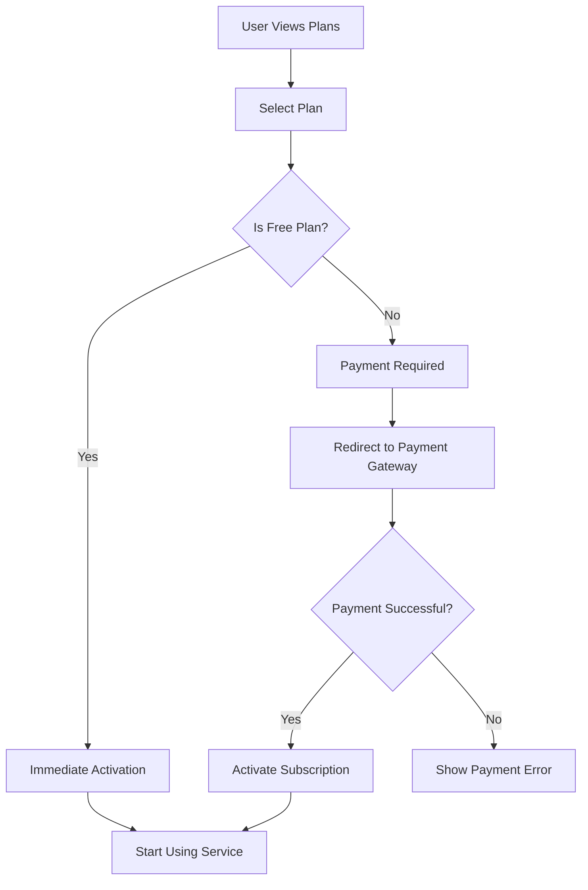
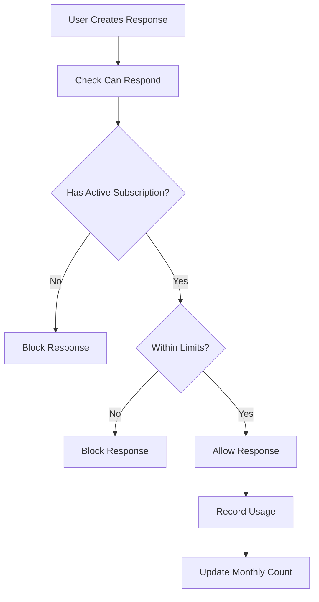
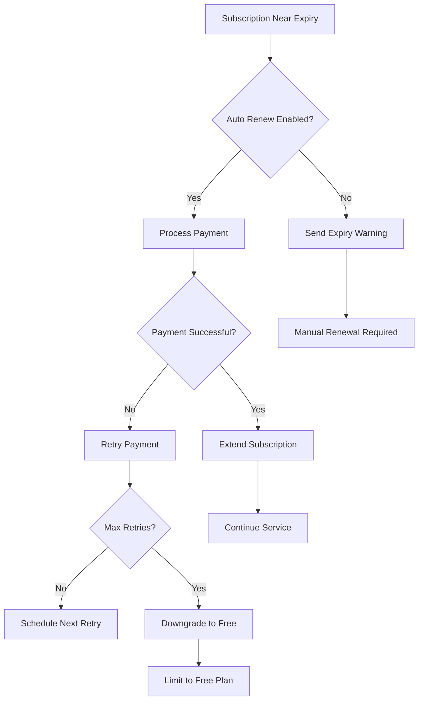

# Subscription Management System

## Overview

The Subscription Management System provides a comprehensive platform for managing user subscriptions with template-based plans, country-specific pricing, automatic renewals, and payment integration. The system supports both free and paid subscription tiers with usage tracking and lifecycle management.

## Architecture

### Template-Based Design
- **Super Admin** creates subscription plan templates
- **Country Admin** sets local pricing and submits for approval
- **Automatic currency detection** based on country
- **Centralized plan management** with localized pricing

### Key Components
1. **Subscription Plans**: Template definitions with features and limits
2. **Country Pricing**: Localized pricing and currency for each plan
3. **User Subscriptions**: Individual user subscription records
4. **Usage Tracking**: Monthly response count monitoring
5. **Payment Integration**: Automated payment processing and renewals

## Database Schema

### simple_subscription_plans
```sql
CREATE TABLE simple_subscription_plans (
    id SERIAL PRIMARY KEY,
    code VARCHAR(50) UNIQUE NOT NULL,
    name VARCHAR(255) NOT NULL,
    description TEXT,
    features JSONB DEFAULT '[]',
    default_price DECIMAL(10,2) DEFAULT 0,
    default_currency CHAR(3) DEFAULT 'USD',
    default_response_limit INTEGER DEFAULT 3,
    is_active BOOLEAN DEFAULT true,
    created_at TIMESTAMP DEFAULT CURRENT_TIMESTAMP,
    updated_at TIMESTAMP DEFAULT CURRENT_TIMESTAMP
);
```

### simple_subscription_country_pricing
```sql
CREATE TABLE simple_subscription_country_pricing (
    id SERIAL PRIMARY KEY,
    plan_code VARCHAR(50) NOT NULL REFERENCES simple_subscription_plans(code),
    country_code CHAR(2) NOT NULL,
    price DECIMAL(10,2) NOT NULL,
    currency CHAR(3) NOT NULL,
    response_limit INTEGER NOT NULL,
    is_active BOOLEAN DEFAULT true,
    created_by UUID REFERENCES users(id),
    approved_by UUID REFERENCES users(id),
    approval_status VARCHAR(20) DEFAULT 'pending',
    created_at TIMESTAMP DEFAULT CURRENT_TIMESTAMP,
    updated_at TIMESTAMP DEFAULT CURRENT_TIMESTAMP,
    UNIQUE(plan_code, country_code)
);
```

### user_simple_subscriptions
```sql
CREATE TABLE user_simple_subscriptions (
    id SERIAL PRIMARY KEY,
    user_id UUID NOT NULL REFERENCES users(id),
    plan_code VARCHAR(50) NOT NULL REFERENCES simple_subscription_plans(code),
    country_code CHAR(2) NOT NULL,
    status VARCHAR(20) DEFAULT 'active',
    started_at TIMESTAMP DEFAULT CURRENT_TIMESTAMP,
    expires_at TIMESTAMP,
    last_payment_date TIMESTAMP,
    next_payment_date TIMESTAMP,
    payment_amount DECIMAL(10,2),
    payment_currency CHAR(3),
    payment_method VARCHAR(50),
    payment_gateway_id INTEGER,
    auto_renew BOOLEAN DEFAULT true,
    created_at TIMESTAMP DEFAULT CURRENT_TIMESTAMP,
    updated_at TIMESTAMP DEFAULT CURRENT_TIMESTAMP,
    UNIQUE(user_id)
);
```

### usage_monthly
```sql
CREATE TABLE usage_monthly (
    id SERIAL PRIMARY KEY,
    user_id UUID NOT NULL REFERENCES users(id),
    year_month VARCHAR(6) NOT NULL, -- Format: YYYYMM
    response_count INTEGER DEFAULT 0,
    created_at TIMESTAMP DEFAULT CURRENT_TIMESTAMP,
    updated_at TIMESTAMP DEFAULT CURRENT_TIMESTAMP,
    UNIQUE(user_id, year_month)
);
```

## API Endpoints

### User Subscription Endpoints

#### Get Subscription Status
```http
GET /api/simple-subscription/status
Authorization: Bearer {token}
```

**Response:**
```json
{
  "success": true,
  "subscription": {
    "planCode": "Pro",
    "planName": "Pro Plan",
    "status": "active",
    "startedAt": "2025-09-01T00:00:00.000Z",
    "expiresAt": "2025-10-01T00:00:00.000Z",
    "responsesUsed": 15,
    "responsesLimit": -1,
    "responsesRemaining": -1,
    "canRespond": true,
    "autoRenew": true,
    "paymentAmount": 3500.00,
    "paymentCurrency": "LKR",
    "nextPaymentDate": "2025-10-01T00:00:00.000Z"
  }
}
```

#### Get Available Plans
```http
GET /api/simple-subscription/plans?country=LK
```

**Response:**
```json
{
  "success": true,
  "plans": [
    {
      "code": "Free",
      "name": "Free Plan",
      "description": "Perfect for small businesses starting out",
      "features": [],
      "price": "0.00",
      "currency": "LKR",
      "response_limit": 3,
      "country_pricing_active": true,
      "pricing_created_at": "2025-09-12T10:31:07.582Z"
    },
    {
      "code": "Pro",
      "name": "Pro Plan",
      "description": "Unlimited Responses",
      "features": [],
      "price": "3500.00",
      "currency": "LKR",
      "response_limit": -1,
      "country_pricing_active": true,
      "pricing_created_at": "2025-09-12T10:33:55.675Z"
    }
  ]
}
```

#### Subscribe to Plan
```http
POST /api/simple-subscription/subscribe
Authorization: Bearer {token}
Content-Type: application/json

{
  "planCode": "Pro"
}
```

**Response:**
```json
{
  "success": true,
  "requiresPayment": true,
  "paymentId": "pay_12345",
  "checkoutUrl": "https://checkout.stripe.com/...",
  "message": "Payment required for Pro plan",
  "subscription": {
    "planCode": "Pro",
    "status": "pending_payment",
    "paymentAmount": 3500.00,
    "paymentCurrency": "LKR"
  }
}
```

#### Check Response Eligibility
```http
GET /api/simple-subscription/can-respond
Authorization: Bearer {token}
```

#### Record Response Usage
```http
POST /api/simple-subscription/record-response
Authorization: Bearer {token}
Content-Type: application/json

{
  "requestId": "uuid-request-id"
}
```

### Admin Endpoints

#### Get All Plans (Admin)
```http
GET /api/admin/subscription/plans
Authorization: Bearer {token}
```

#### Create Plan Template (Super Admin)
```http
POST /api/admin/subscription/plans
Authorization: Bearer {token}
Content-Type: application/json

{
  "code": "Premium",
  "name": "Premium Plan",
  "description": "Advanced features for power users",
  "features": ["unlimited_responses", "priority_support", "analytics"],
  "defaultPrice": 99.99,
  "defaultCurrency": "USD",
  "defaultResponseLimit": -1
}
```

#### Update Plan Template
```http
PUT /api/admin/subscription/plans/{code}
Authorization: Bearer {token}
```

#### Set Country Pricing
```http
POST /api/admin/subscription/country-pricing
Authorization: Bearer {token}
Content-Type: application/json

{
  "planCode": "Pro",
  "countryCode": "LK",
  "price": 3500.00,
  "currency": "LKR",
  "responseLimit": -1
}
```

#### Approve Country Pricing
```http
PATCH /api/admin/subscription/country-pricing/{id}/approve
Authorization: Bearer {token}
```

## Subscription Lifecycle

### 1. Plan Selection


### 2. Usage Tracking


### 3. Renewal Process


## Payment Integration

### Payment Flow
1. **Plan Selection**: User chooses paid plan
2. **Gateway Selection**: System identifies primary gateway for country
3. **Payment Session**: Create checkout session with gateway
4. **Payment Processing**: Handle payment via configured gateway
5. **Confirmation**: Webhook confirms payment success
6. **Activation**: Subscription activated immediately

### Supported Payment Gateways
- **Stripe**: Global coverage with instant activation
- **PayPal**: Wide international support
- **Razorpay**: India-specific integration
- **PayHere**: Sri Lanka local payment gateway
- **Bank Transfer**: Manual verification required

### Payment Status Tracking
```sql
-- Subscription payment statuses
'pending_payment'   -- Awaiting payment processing
'active'           -- Paid and active
'past_due'         -- Payment failed, grace period
'canceled'         -- User canceled subscription
'expired'          -- Subscription expired
'free'             -- Free plan (no payment required)
```

## Usage Limits and Enforcement

### Response Limits
- **Free Plan**: 3 responses per month
- **Pro Plan**: Unlimited responses (-1)
- **Custom Plans**: Configurable limits

### Enforcement Logic
```javascript
// Check if user can respond
const canRespond = (subscription, monthlyUsage) => {
  if (!subscription || subscription.status !== 'active') {
    return { canRespond: false, reason: 'no_subscription' };
  }
  
  if (subscription.responseLimit === -1) {
    return { canRespond: true, reason: 'unlimited' };
  }
  
  if (monthlyUsage >= subscription.responseLimit) {
    return { canRespond: false, reason: 'limit_exceeded' };
  }
  
  return { 
    canRespond: true, 
    responsesRemaining: subscription.responseLimit - monthlyUsage 
  };
};
```

## Country-Specific Features

### Currency Auto-Detection
```javascript
const getCurrencyForCountry = (countryCode) => {
  const currencyMap = {
    'US': 'USD', 'CA': 'CAD', 'GB': 'GBP',
    'LK': 'LKR', 'IN': 'INR', 'AU': 'AUD'
  };
  return currencyMap[countryCode] || 'USD';
};
```

### Pricing Management
- Country admins set local pricing
- Automatic currency conversion suggestions
- Regional payment method preferences
- Local tax and fee calculations

## Flutter App Integration

### Service Implementation
```dart
class SimpleSubscriptionService {
  // Get user subscription status
  Future<SimpleSubscriptionStatus?> getSubscriptionStatus();
  
  // Get available plans for country
  Future<List<SubscriptionPlan>> getAvailablePlans();
  
  // Subscribe to a plan
  Future<SubscriptionResult> subscribeToPlan(String planCode);
  
  // Check response eligibility
  Future<ResponseEligibility> canRespond();
  
  // Record response usage
  Future<bool> recordResponse(String requestId);
}
```

### UI Components
- **Subscription Plans Screen**: Display available plans
- **Payment Processing**: Handle checkout flow
- **Subscription Status**: Show current plan and usage
- **Upgrade Prompts**: Encourage plan upgrades

## Administrative Features

### Super Admin Capabilities
- Create and manage plan templates
- Set default pricing and features
- Approve country-specific pricing
- Monitor global subscription metrics
- Manage payment gateway configurations

### Country Admin Capabilities
- Set local pricing for plans
- Configure country payment gateways
- View local subscription statistics
- Manage country-specific features
- Handle customer support issues

### Reporting and Analytics
- Subscription conversion rates
- Revenue by country and plan
- Usage patterns and trends
- Payment success rates
- Customer lifetime value

## Automated Management

### Subscription Lifecycle Script
```bash
# Run daily to manage subscription lifecycle
node backend/scripts/subscription-lifecycle.js
```

**Functions:**
- Process upcoming renewals
- Handle failed payments
- Send expiry notifications
- Downgrade expired subscriptions
- Clean up old usage data

### Monitoring and Alerts
- Payment processing failures
- High subscription cancellation rates
- Unusual usage patterns
- Gateway downtime alerts
- Revenue anomalies

## Security Considerations

### Data Protection
- Encrypt sensitive payment information
- PCI DSS compliance for payment data
- GDPR compliance for user data
- Regular security audits
- Secure API endpoints

### Access Control
- Role-based permissions
- JWT token authentication
- API rate limiting
- Country-specific data isolation
- Admin action logging

## Performance Optimization

### Caching Strategy
- Cache active subscriptions
- Cache plan definitions
- Cache usage counters
- Optimize database queries
- Use Redis for session data

### Scalability
- Horizontal database scaling
- Load balancer configuration
- CDN for static assets
- Background job processing
- Microservice architecture ready

## Testing

### Unit Tests
- Subscription logic validation
- Payment processing simulation
- Usage limit enforcement
- Country pricing calculations

### Integration Tests
- End-to-end subscription flow
- Payment gateway integration
- Admin panel functionality
- Mobile app integration

### Load Testing
- High-volume subscription processing
- Concurrent payment processing
- Database performance under load
- API response times

## Deployment

### Environment Configuration
```env
# Subscription System
STRIPE_PUBLISHABLE_KEY=pk_test_...
STRIPE_SECRET_KEY=sk_test_...
PAYPAL_CLIENT_ID=...
PAYPAL_CLIENT_SECRET=...

# Database
DATABASE_URL=postgresql://...

# Security
JWT_SECRET=...
ENCRYPTION_KEY=...
```

### Production Checklist
- [ ] Configure production payment gateways
- [ ] Set up monitoring and alerting
- [ ] Enable HTTPS/SSL certificates
- [ ] Configure backup systems
- [ ] Set up log aggregation
- [ ] Performance monitoring
- [ ] Security scanning
- [ ] Load balancer configuration

## Migration Guide

### From Legacy System
1. Export existing subscription data
2. Map users to new subscription format
3. Migrate payment methods
4. Update API integrations
5. Test thoroughly before cutover

### Data Migration Script
```sql
-- Migrate legacy subscriptions
INSERT INTO user_simple_subscriptions (user_id, plan_code, status, started_at)
SELECT user_id, 
       CASE WHEN is_premium THEN 'Pro' ELSE 'Free' END,
       'active',
       created_at
FROM legacy_subscriptions;
```

## Support and Maintenance

### Common Issues
1. **Payment Failures**: Check gateway status and credentials
2. **Usage Not Updating**: Verify response recording logic
3. **Subscription Not Activating**: Check webhook configurations
4. **Country Pricing Missing**: Ensure pricing is configured and approved

### Maintenance Tasks
- Monthly usage data cleanup
- Subscription renewal processing
- Payment gateway health checks
- Database performance optimization
- Security updates and patches

## Contact and Support

For technical assistance:
- **Development Team**: dev@requestmarketplace.com
- **Documentation**: https://docs.requestmarketplace.com/subscriptions
- **Admin Support**: Available in admin panel
- **Emergency Contact**: +94-XXX-XXX-XXXX (24/7 support)
